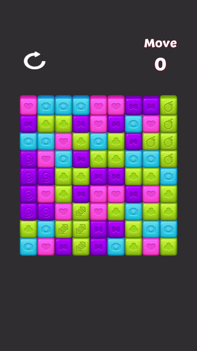

# ColorBlast 🎮

> A Toon Blast–inspired match & blast puzzle project — built from the ground up to advance my technical skills and gain hands-on experience with production-level systems, decoupled architecture (SOLID), and scalable codebase structures. I focused on creating a modular, testable, and extensible architecture applicable to large-scale software systems.

---

## 🎬 Gameplay Preview

#### Combos
| Bomb × Rocket | Disco Ball × Bomb | Bomb × Bomb |
| :---: | :---: | :---: |
|  |  |  |
| **💣 + 🚀 Bomb × Rocket** | **🪩 + 💣 Disco Ball × Bomb** | **💣 + 💣 Bomb × Bomb** |

| Chain Reactions | Disco Ball × Rocket | Disco Ball × Disco Ball |
| :---: | :---: | :---: |
|  |  |  |
| **⛓️ Chain Reactions** | **🪩 + 🚀 Disco Ball × Rocket** | **🪩 + 🪩 Disco Ball × Disco Ball** |

| Disco Ball | Rocket × Rocket |
| :---: | :---: |
|  |  |
| **🪩 Disco Ball** | **🚀 + 🚀 Rocket × Rocket** |

---

## 🎓 What I Learned

This project was my hands-on practice for concepts I wanted to understand at a production level — not just read about.

### Async Programming with UniTask
Replaced all coroutines with **UniTask** for asynchronous workflow management. I learned how `async/await` works in a game context — running multiple tasks at the same time with `UniTask.WhenAll`, fire-and-forget tasks with `.Forget()`, and how to properly cancel ongoing async operations. The trickiest part was managing chain reactions: multiple effects can run at the same time without conflicting with each other or the grid state.

### Effect Pipeline & Chain Reaction Architecture
Built an `EffectPipeline` that manages the full lifecycle of a player tap: running the effect, tracking which blocks have already been triggered (to avoid double-firing), pausing gravity during disco animations, and updating the grid afterward. Each effect is a self-contained class that only knows about its own logic. Adding a new special block just means implementing one interface — nothing else needs to change.

### Design Patterns
- **Command Pattern** — Each block effect (`IBlockEffect`) is an executable action, keeping trigger logic completely separate from what actually happens.
- **Factory Pattern** — `BlockEffectFactory` figures out the right effect (or combo effect) for any tapped block, including combo detection.
- **Object Pool Pattern** — A generic `PoolManager<TKey, TObject>` base class is shared by both the block pool and particle pool. Pools grow automatically and call `OnSpawn`/`OnDespawn` on each object.
- **Strategy Pattern** — Block behaviors are defined through interfaces (`IMatchable`, `IInteractable`, `IActivatable`, `IRecolorable`) instead of big inheritance trees or type-switch chains.
- **Observer Pattern** — `EventManager` keeps input and gameplay decoupled. A tap hits a block, the block fires an event, and `GridManager` reacts — no direct dependency between them.
- **Facade Pattern** — `GridSystems` builds and wires all grid subsystems and exposes them as a single object to `GridManager`.

### Modular, Interface-Driven Architecture
Services like haptics and particles are injected through interfaces, so nothing hard-depends on a specific platform or implementation. The core grid subsystems (`GridChecker`, `GridRefill`, `GridShuffler`, `GridSpawner`) are plain C# classes — no `MonoBehaviour`, no Unity lifecycle — which makes them easy to test and reuse.

### ScriptableObject-Driven Data
All gameplay data (configs, block visuals, level settings, color databases) lives in ScriptableObjects. Block types own their own data, which makes adding new content completely designer-friendly and requires no code changes.

---

## 🎮 What is ColorBlast?

ColorBlast is a match & blast puzzle game. The board is a 2D grid filled with colored blocks and special blocks. The goal is to clear blocks by tapping groups and triggering special effects. No dragging or swapping — everything is a single tap.

### How to Play

- **Tap** any colored cube that belongs to a connected group of 2 or more same-colored cubes to destroy the whole group.
- Remaining blocks fall down to fill the gaps, and new cubes spawn from above.
- If there are no valid matches left, the grid automatically **shuffles** with an animation.
- Destroying a large enough group spawns a **Special Block** at the tap position as a reward.

---

## ✨ Block Types & Effects

### 🟦 Cube
The standard block. Tap a connected group of 2+ same-colored cubes to clear them all. The cube's icon updates based on how large the connected group is, hinting at the reward you'll get.

| Group Size | Reward |
|---|---|
| < 4 | Nothing — cubes just clear |
| 4+ | Spawns a **Rocket** |
| 5+ | Spawns a **Bomb** |
| 6+ | Spawns a **Disco Ball** |

---

### 💣 Bomb
Destroys all blocks within a square radius around it.

---

### 🚀 Rocket
Fires two projectiles in opposite directions along its axis (horizontal or vertical), clearing everything in both lines. Direction is randomly assigned on spawn.

---

### 🪩 Disco Ball
Targets every block on the board that matches its assigned color and destroys them all with a beam animation.

---

## 💥 Combos

Combos happen when two or more Special Blocks are **directly adjacent** and one is tapped. The two highest-priority blocks merge and produce a stronger combined effect. A merge animation plays before the effect fires.

**Priority order: Disco Ball > Bomb > Rocket**

---

### 🚀 + 🚀 Rocket × Rocket
Fires both a horizontal and vertical line from the same position — a cross-shaped clear.

---

### 💣 + 💣 Bomb × Bomb
Multiplies the blast radius, clearing a much larger area than a single Bomb.

---

### 💣 + 🚀 Bomb × Rocket
Fires a full Rocket line from every row and column within the Bomb's radius.

---

### 🪩 + 🚀 Disco Ball × Rocket
Replaces every block of the target color with a Rocket, then fires them all sequentially.

---

### 🪩 + 💣 Disco Ball × Bomb
Replaces every block of the target color with a Bomb, then detonates them all sequentially.

---

### 🪩 + 🪩 Disco Ball × Disco Ball
Destroys every single block on the board.

---

## ⛓️ Chain Reactions

When a special block is hit during an effect — by a rocket projectile, a bomb blast, or a disco beam — it doesn't just get destroyed. It **activates** and fires its own effect concurrently, creating natural chain reactions. A rocket can hit a bomb, which explodes and catches two more rockets, which each clear their lines across the board.

Each block can only trigger once per interaction, so chains never loop or duplicate.

---

## 🏗️ Project Structure

```
Assets/_ColorBlast/Scripts/
├── Core/           # Platform-agnostic systems: object pool, haptics, scene loading
├── Features/       # Game domain logic
│   ├── Block/      # Block base class, all block types and their data
│   ├── Effects/    # IBlockEffect implementations for every block and combo
│   ├── Grid/       # GridChecker, GridSpawner, GridRefill, GridShuffler, ComboDetector
│   ├── VFX/        # Particle service, animation helpers, poolable VFX
│   ├── Camera/     # Responsive camera framing
│   └── Config/     # GameConfig ScriptableObject
├── Manager/        # MonoBehaviour orchestrators: GameManager, GridManager, UIManager, pool managers
├── Input/          # PlayerController, PlayerInputHandler (Unity Input System)
└── Generated/      # Auto-generated input action C# class
```

---

## 🔧 Built With

- **Unity** (2022 LTS+)
- **UniTask** — zero-allocation async/await for Unity
- **DOTween** — animation and tweening
- **Unity Input System** — cross-platform input with generated action classes
- **ScriptableObjects** — data-driven block and level configuration

---

## 🚀 Status & Future Roadmap
Core gameplay systems—including all special blocks, 6 combo types, asynchronous chain reactions, generic object pooling, cross-platform haptics, and deadlock detection—are fully functional.

The project is designed with a modular architecture to easily support the following upcoming implementations:
- Session & Flow Management: Implementation of a global state machine to handle transitions between the Main Menu, Gameplay, and Result screens.
- Audio System: A decoupled, event-driven audio manager for SFX and background music.
- Goal & Level System: An interface-driven Goal Manager to track level objectives and player progress.
- UI/UX Polish: Integration of reusable UI components for settings and in-game overlays.

---